# Frontend Mentor - Space tourism website solution

This is a solution to the [Space tourism website challenge on Frontend Mentor](https://www.frontendmentor.io/challenges/space-tourism-multipage-website-gRWj1URZ3). Frontend Mentor challenges help you improve your coding skills by building realistic projects. 

## Table of contents

- [Overview](#overview)
  - [The challenge](#the-challenge)
  - [Screenshot](#screenshot)
  - [Links](#links)
- [My process](#my-process)
  - [Built with](#built-with)
  - [What I learned](#what-i-learned)
  - [Continued development](#continued-development)
  - [Useful resources](#useful-resources)
- [Author](#author)
- [Acknowledgments](#acknowledgments)

## Overview

### The challenge

Users should be able to:

- View the optimal layout for each of the website's pages depending on their device's screen size
- See hover states for all interactive elements on the page
- View each page and be able to toggle between the tabs to see new information

### Screenshot

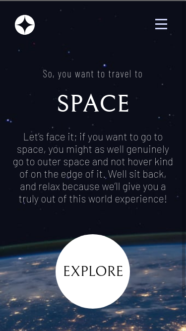
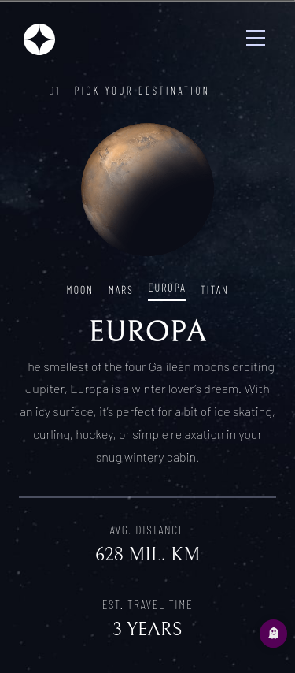
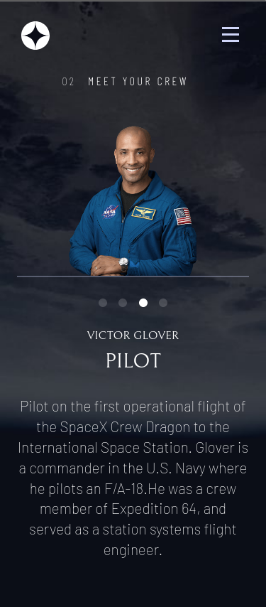
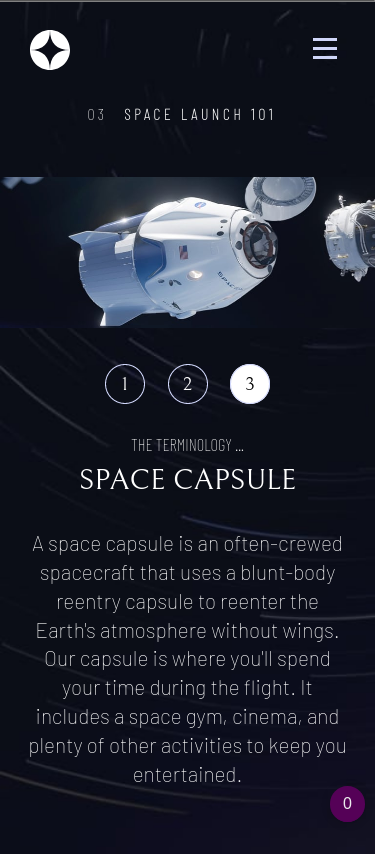
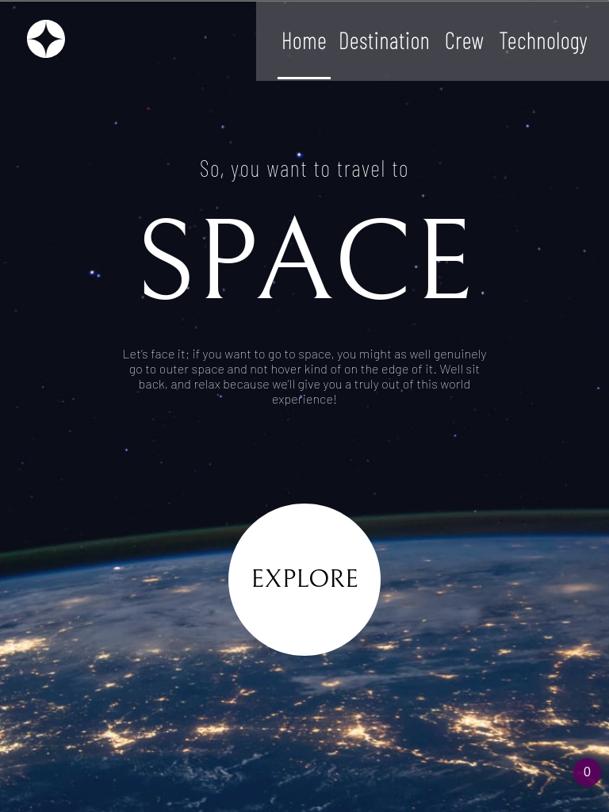
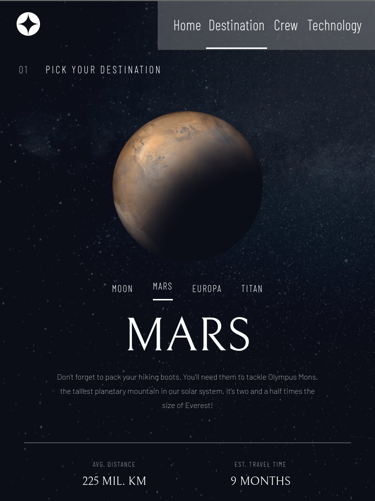
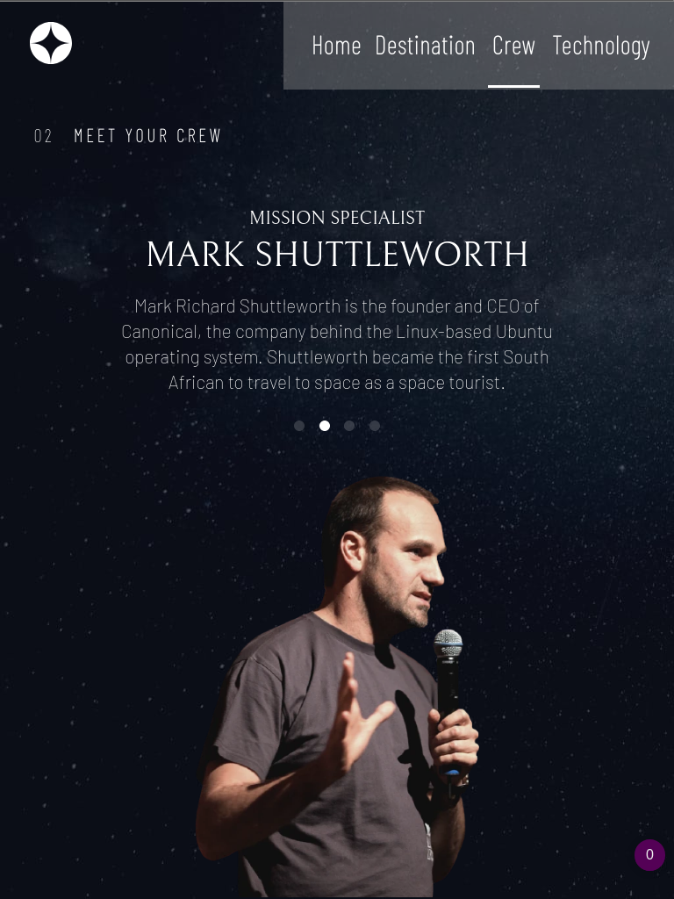
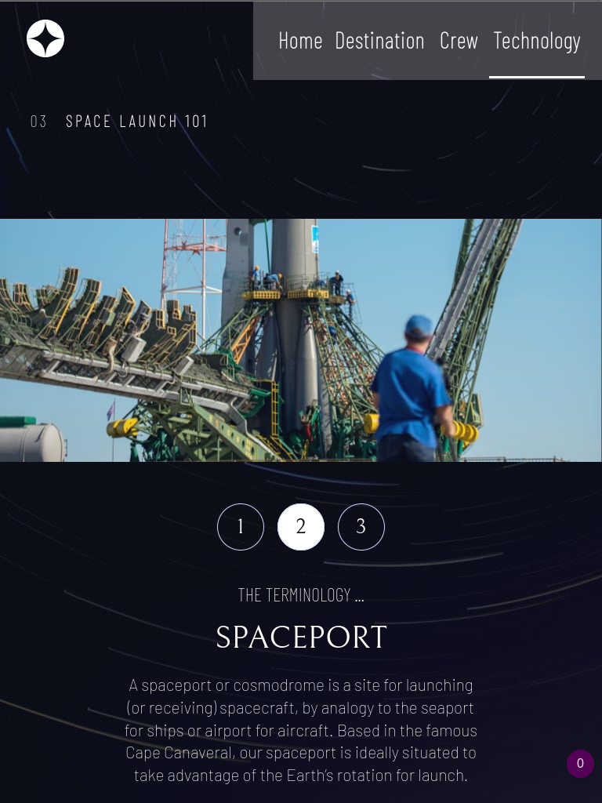
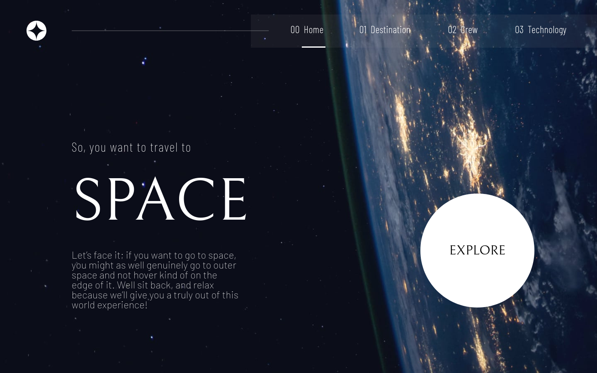
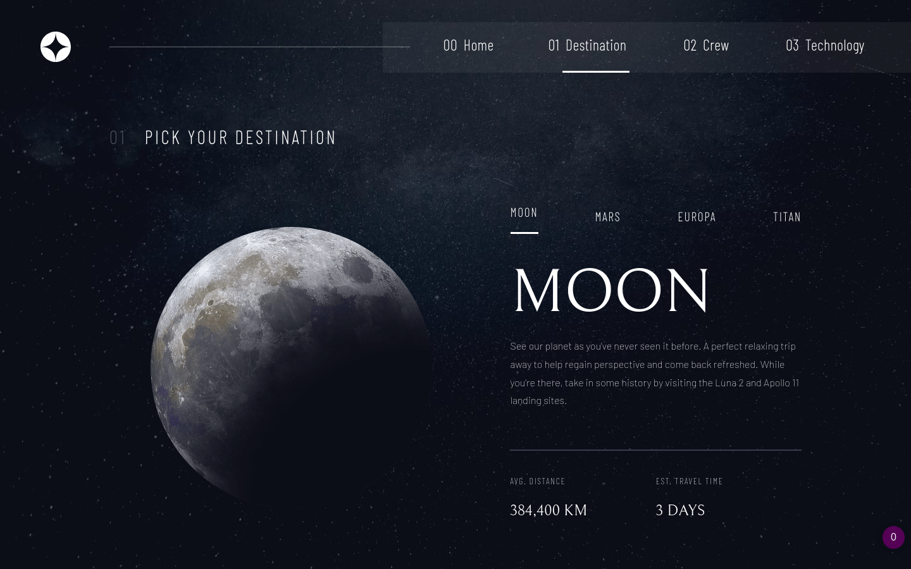
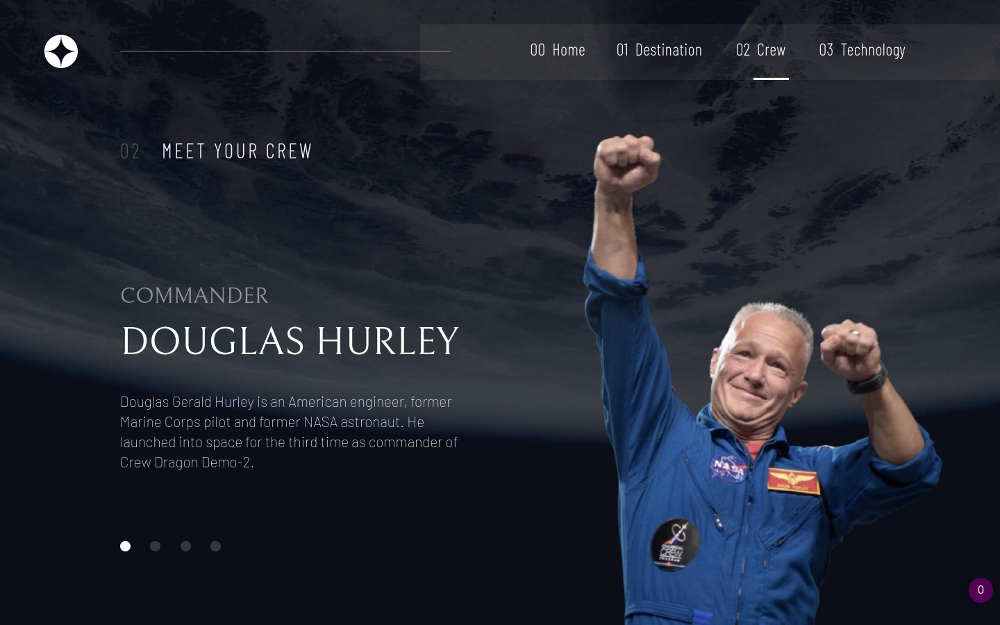
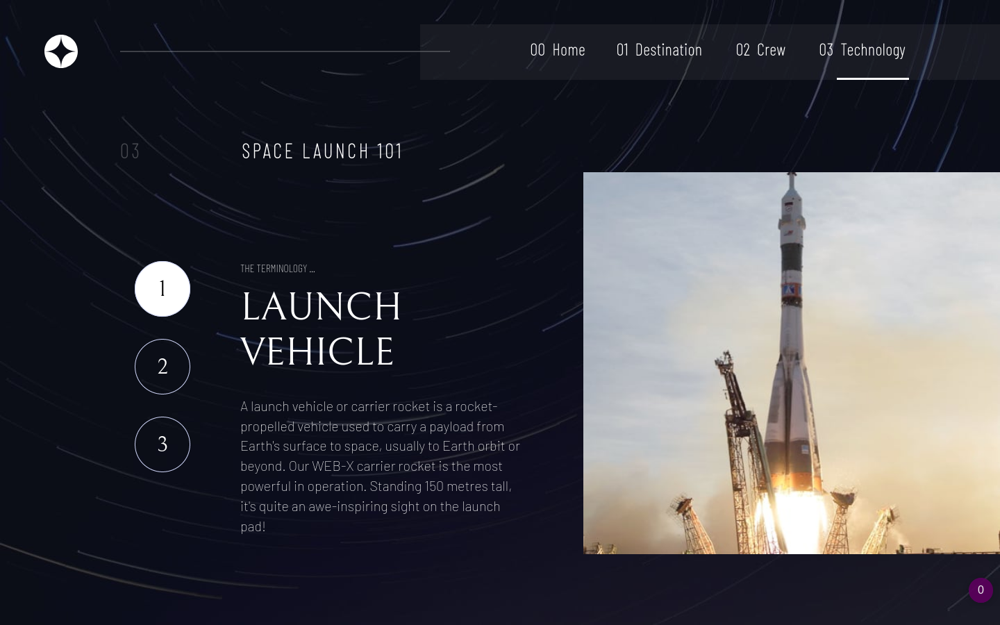

### Links

- Solution URL: [Solution URL](https://github.com/simplegoose/space-website)
- Live Site URL: [Site URL](https://space-website-lilac.vercel.app)

## My process

### Built with

- Semantic HTML5 markup
- SaaS
- CSS custom properties
- Flexbox
- Mobile-first workflow

### Continued development

I would like to continue sharpening on CSS grid that I haven't used in this projects. I would as well like to develop my skills in SaSS

### Useful resources

- [Example resource 1](https://www.sass-lang.com) - This helped me recap on the SaSS concepts I had forgotten.
- [Example resource 2](https://dev.to/snkds/how-to-enable-backdrop-filter-in-firefox-2n8e) - This is an amazing article which helped me to enable backdrop-filter in my browser.

## Author

- Website - [Timothy Njoroge](https://www.timothynjoroge.herokuapp.com)
- Frontend Mentor - [@simplegoose](https://www.frontendmentor.io/profile/simplegoose)
- Twitter - [@njorogemwangi21](https://www.twitter.com/njorogemwangi21)

